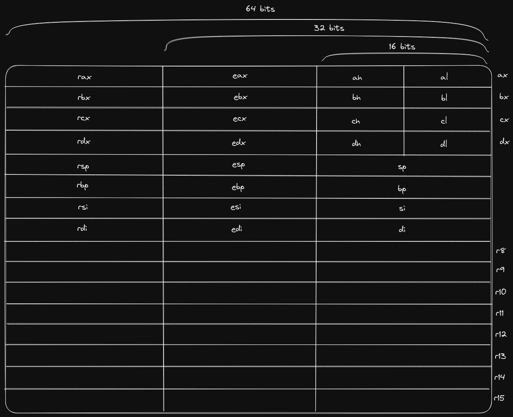

# Computer Enhance

```bash
# Use nasm assembler to output decode assembly.
nasm listing_0037_single_register_mov.asm

# Compare original assembly output with the decoder output.
diff listing_0037_single_register_mov test
```

# Notes

## CPU Registers


## ASM
```asm
; Comparing register with memory (bx - register, [bp +0] - memory)
cmp bx, [bp + 0]

; MOV into accumulator (ax is the primary accumulator)
mov ax, 10
```

## CPU Layers


## From 8086 to x64

- Extended CPU registers: rax, rbx, ...
- Effective Adress Calculation is more flexible:
    - Can have any register instead of bp, si, ...
    - Allow multiplication
- Added 8 registers: r8, r9, ..., r15
    - To access you now use this table

|       |        |
|-------|--------|
| BYTE  | 8-bit  |
| WORD  | 16-bit |
| DWORD | 32-bit |
| QWORD | 64-bit |

e.g. r8D

