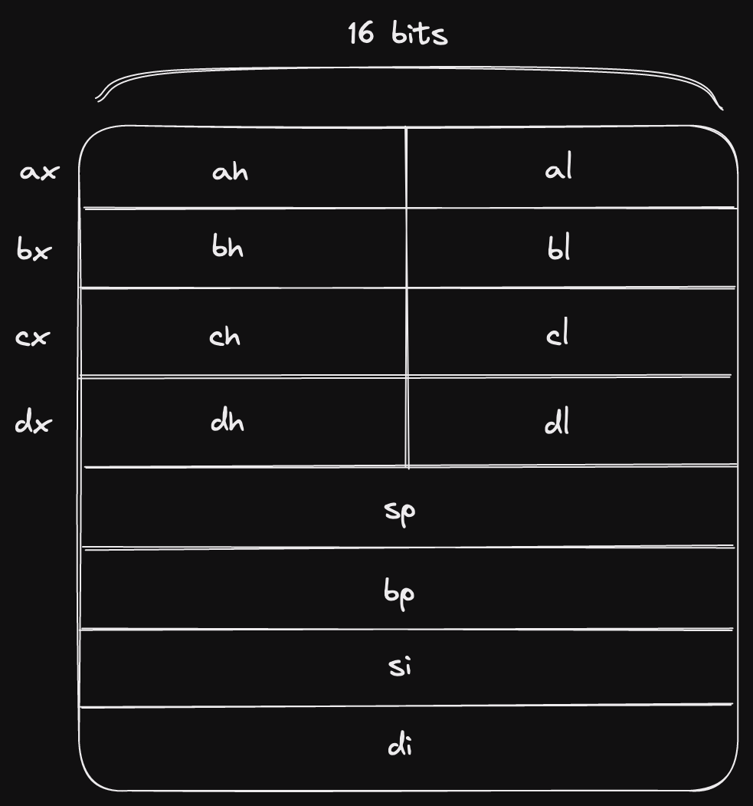
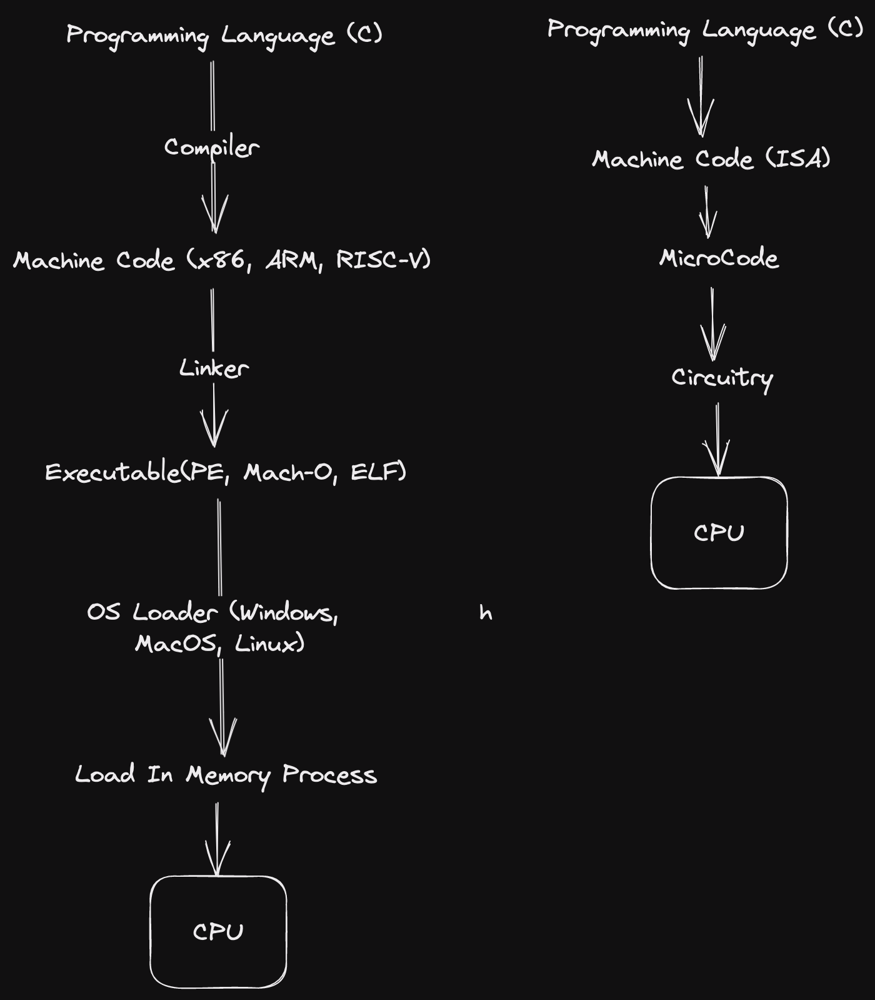

# Computer Enhance

```bash
# Use nasm assembler to output decode assembly.
nasm listing_0037_single_register_mov.asm

# Compare original assembly output with the decoder output.
diff listing_0037_single_register_mov test
```

# Notes

## CPU Registers


## ASM
```asm
; Comparing register with memory (bx - register, [bp +0] - memory)
cmp bx, [bp + 0]

; MOV into accumulator (ax is the primary accumulator)
mov ax, 10
```

## CPU Layers

